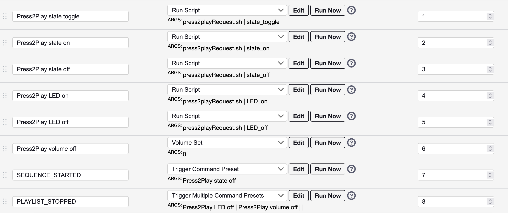

# Press2play FPP plugin

A press2play plugin to allow pedestrian traffic to listen to the current currently playing song through speakers rather than through an FM radio. The pedestrian simply presses a button and speakers play the current song until it is finished.

## How it works

This plugin requires two FPP-based devices: a primary *player* device (that is used to control the show) and a *remote* device to implement the "press2play" functionaltiy. The *press2play* device is physically hooked up to a push button and speakers. When the button is pressed, the currently playing song plays music through the attached speakers until the song's completion. Additionally, if desired, LEDs can be hooked up to the *remote* device and used to catch the eye of passing pedestrians. While the show is playing, the LEDs slowly blink on and off. When the button is pressed, the LEDs turn off until the song's completion, after which they start to slowly blink on and off. 

## Plug-in setup
1. To install the plugin, go to "Content Setup" -> "Plugin Manager". Within the "Find a Plugin or Enter a plugininfo.json URL," paste in https://raw.githubusercontent.com/watkinrt/fpp-press2play/master/pluginInfo.json,press the "Get Plugin Info" button, and then press the "Install" button under the "Press-to-play" pluggin line item.
2. Once installed, navigate to "Input/Output Setup" -> "Press2Play" to setup your desired software and hardware configuration. 
    - If you run into issues with uncaptured button presses, try deceasing the "debounce" time.
3. Define the below Command Presets to handle turning the music off and and other relevant events.

## Hardware setup

*Insert Rasberry Pi image*

- A Raspberry Pi Zero 2, 3, or 4. Note that, if using a Raspberry Pi Zero, the audio will need to be output via a USB connection.
- Connect the Rasberry Pi to a speaker via the audio jack or through a USB sound card (like the Sound Blaster Play! 3 by Creative Labs).
- Connect a momentary-on button between the specified GPIO pin in the plug-in setup (default is GPIO26) and GND.
- (Optional) The status LED is controlled via the specified GPIO pin in the plug-in setup (default is GPIO18). For a simple status LED, simply connect the LED to GPIO18 and GND (noting to add in a resistor between the (+) leg [longer leg] and the GPIO pin). Or, for a slightly more complex setup, connect the GPIO pin to some form of a solid state relay (such as a MOSFET transitor) and use this relay to control an LED string, a set of LED strings, or an LED within an illuminating button. Note, a mechanical relay is discouraged as the LED brightness is controlled via PWM.

## Limitations

- This plugin is only compatible with Raspberry Pi-based FPP devices.
- Requires FPP v7 or higher.
